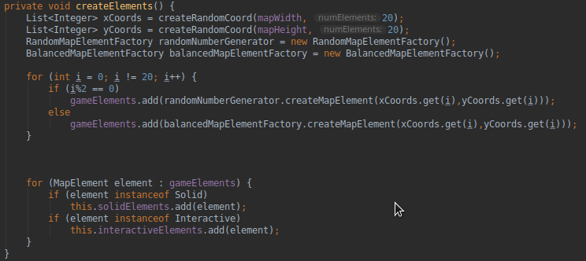

# LPOO_T6 Rogue XXI

 Our game is inspired by *Rogue: Exploring the Dungeons of Doom*, the game that created  the *Roguelike* genre. *Rouge* is a random *dungeon crawler*, that progresses through increasingly difficult levels until the player reaches the end.

Developed by:   
Miguel Rosa - up 20170695 
Rita Mota - up201703964

## Implemented Features

 We divided the implemented features in two categories: the UI (user interface) and the main game.
 
The UI concerns features that help to guide and inform the player but do not impact the *core game loop*. On the other hand, the main game features are those who compose the main game loop. 
### UI
- Glossary:
-- The illustration of the different elements that can show on the game0
- Inventory:
-- The list of player's items and his current weapon
- Legend:
-- The list of current available commands, it is always present on the lower part of the screen
- Main menu
-- The starting place, when you start the game
- Achievements
-- A signal of progress in the game, most of them will be counters of game functionalities. Will have a separate window (like inventory and glossary)
-End Game Screen
-- A way of telling the player they either win or lost the game
### Main Game
- Display
-- All the classes can be displayed be placed on the map.
-- Every object is being placed randomly with the beginning of a new game.
- Movement
-- Currently you can walk through the whole map, by using the arrow keys, except in the spot where a *Solid* object is, which is the case for all objects except Corpses.
- Interactions
-- All interactions are made by standing right next to an object and clicking (E).
-- Interacting with a corpse or a chest will take their items and put them in your inventory.
-- Interacting with a Billboard will make his message appear on the console.
- Combat and HP.
-- Combat is made by standing right next to an enemy, represented by M and V, and walking towards him.
-- Only Warriors (W) can attack.
--Every weapon a luck percentage that influences the success of an atack. This is made by generating a random number between 0 and 100 and if the number generated is smaller that the luck percentage the attack takes place.
-- When a *NPC* or a *Warrior* dies they transform into a Corpse with lootable items. 

- Winning the game
-- The player wins if he is able to kill all warriors. The number of generated warriors per play is generated randomly with a minimum of 2.
-- The player loses if the Hero dies, which is only possible if he loses all HP whilst in combat with a Warrior.

## Planned Features

We had many features planned, but due to time constraints they were impossible to implement, but still we want to show the ways in which we wanted to improve our project.
### UI
We completed the goals we set in previus report, but still were things that we wanted to improve.
 - Swing
-- Swing was a purely aesthetic feature but still we wanted to implement it.
 - Game notifications
--Currently our notifications are drawn until another message appears. We discussed using theards to display them only for a few seconds but we were unable to make this feature work.
- Expanding pre existing systems
--For the time being we are happy with the current number of instances of the systems we have created, but more instances never hurt!
>
### Main Game
- Marketplace and currency
-- Because many of the items being dropped by the enemies are useless and have no value we wanted to implement a Marketplace where these items could be sold and others could be bought.
- AI movement
-- The enemies are in a static state. Ideally we wanted their movement to be triggered by the hero's movement so that they wouldn't all rush at the player.
- Projectiles
-- The current combat is a bit rudimental, projectiles and ranged combat would improve the current combat system by a lot.

<!-- UML image -->
## Design

### SOLID
 The SOLID principles make the code easy to change. This is a very important principle, because, for example, if we wanted to implement one of our planned features, in the future, we wouldn't have to change a lot of things.
 Our code tries to emulate the SOLID principles, as shown in the UML. The classes try to implement interfaces, and the interfaces tries to represent only one thing.

## Design Paterns

### MVC
This design, separates the code in 3 different parts, the model the view and the controller:

 - The model is where the data is stored.
 - The view controls how data is displayed to the user;
 -  The controller is the one that processes the data stored in the model and holds all the game logic, making sure the view displays things the way it should.

In the last report the MVC was not fully separated, but now the three reside in different packages. This design pattern is extremely useful for altering features, and it was very useful during other reforms done to the code.

### FACTORY 
This is a very common design pattern in Java that allows the creation of factories that have a special way of making a specific set of classes and sub-classes.
In the project it was used to produce the initial objects of the *Model* in 2 diferent ways: a random one and an organized one. The random one is completely random in the kind of subclasses it instanciates, but the organized way instanciates the subclasses in order, making sure that at least one of each is created, but still being random enough to feel fresh in every new play.

### STATE
This desing pattern is very usefull to isolate the diferent states of the game, allowing changes to be made easily and making sure that the problem of one state does not influence other states.
To apply this, the Controller was divided in different states, transforming a huge class (which was a code smell mentioned in the previous report) into smaller and more comprehensible ones.

## Known Code Smells and Refactoring Suggestions

For a better understanding of this session, the references to the past codes smells were left intact.

### Long Class
**Before:** 
As stated in other parts of the project, the Arena class is too big, and can and will be separated in different parts.
 The solution to this problem is to *cut* the class in various classes, particularly the model, view and controller classes.
 
**After:**
This smell was corrected in big part, by dividing the Arena into the MVC  but the *View* and *Model* classes are still a bit bigger than recommended.

<!-- Images off the Arena class -->
### Switch Statemens
**Before:** 
 Many of the functions in the *Arena* class have long chains of *if* and *else*. Many of these can be transformed into *switch*, a more readable version, or even simplified by a auxiliary function.
 
 **After:**
With the State pattern applied to the controller many if, else and switch states disappear minimizing the impact of this particular smell.

<!-- image of the chains of if and else, fond in Arena -->
### Inappropriate Intimacy
**Before:** 
Some of classes have the arguments protected instead of private. In the *Arena* class these class are accessed by his attributes instead of functions. The solution to this problem is to change the attributes to private, and use getter and setter methods instead.

 **After:**
This problem was fully corrected, and the intimacy was replaced by getter and setter methods.

<!-- image of a class using another protect shit, foin in Arena -->
## Testing Results

Our test were directed to the controller, and focus primarily and keytestement and game logic.

The *Model* and *View*were not tested because we did not see much interest in it. The *Model* is primarily composed with sets and gets and the remaining are used in game logic. The *View* is primarily composed by visual components and so it had no interest in testing.

## Self-evaluation
With this project we had to chance to familiarize ourselves with various design patterns and to see their efficiency in making a more useful, readable and compact code.

Unfortunately we did not implement all the features that we wanted, but most of the ones referred in the first report were implemented, and the final code had to be refactored a lot to become the code that we are presenting.

In the current state of the code, thanks to the patterns applied , it's easy to add, remove and we have plans to improve this project past this final submission.
